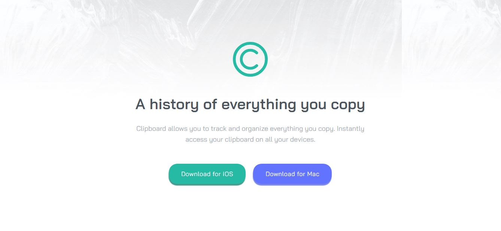

# Frontend Mentor - Clipboard landing page solution

This is a solution to the [Clipboard landing page challenge on Frontend Mentor](https://www.frontendmentor.io/challenges/clipboard-landing-page-5cc9bccd6c4c91111378ecb9). Frontend Mentor challenges help you improve your coding skills by building realistic projects.

## Table of contents

- [Overview](#overview)
  - [The challenge](#the-challenge)
  - [Screenshot](#screenshot)
  - [Links](#links)
- [My process](#my-process)
  - [Built with](#built-with)
  - [What I learned](#what-i-learned)
  - [Continued development](#continued-development)
  - [Useful resources](#useful-resources)
- [Author](#author)
- [Acknowledgments](#acknowledgments)

## Overview

### The challenge

Users should be able to:

- View the optimal layout for the site depending on their device's screen size
- See hover states for all interactive elements on the page

### Screenshot

### Links

- [Live Site URL:](https://guisantosfr.github.io/Clipboard-Landing-Page/)

## My process

### Built with

- Semantic HTML5 markup
- Flexbox
- CSS Grid
- Mobile-first workflow
- [BEM](http://getbem.com/) - CSS methodology
- [SASS](https://sass-lang.com/) - CSS preprocessor

### What I learned

- Working with one component at a time.
- Combining BEM with SASS nesting.
- Approaching media queries with SASS mixins and variables to breakpoints.

### Continued development

In future projects, i want to focus on more SASS concepts and prepare for React library.

### Useful resources

- [DevDocs](https://devdocs.io/) - Documentation of multiple languages and tools in one place.

## Author

- [Linkedin](https://www.linkedin.com/in/guisantosfr/)
- Frontend Mentor - [@guisantosfr](https://www.frontendmentor.io/profile/guisantosfr)
